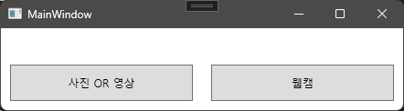
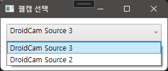
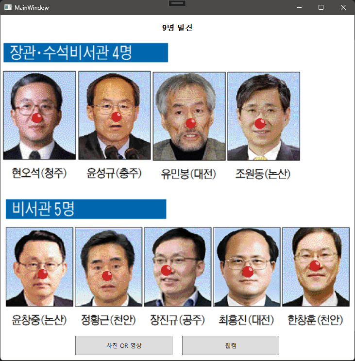
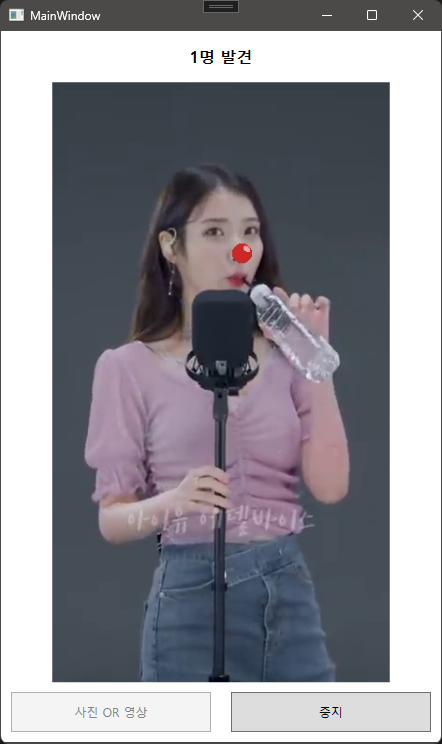

# 루돌프 코 합성기

## 개요

이 프로젝트는 C#/WPF 기반의 영상 처리 애플리케이션으로, **웹캠 또는 이미지 파일 내 얼굴을 인식**하고, **코 부위에 붉은색 원 또는 이미지(PNG)**를 합성하여 루돌프처럼 표현해주는 프로그램입니다.

- 얼굴 검출: `dlib` 사용
- 이미지 처리: `OpenCV`
- UI 구성: `WPF + MVVM 패턴`
- 입력: 웹캠 실시간 영상 / 로컬 이미지/영상 파일
- 출력: 얼굴에 루돌프 코가 합성된 결과 영상 or 이미지

---

## ? 주요 기능

- ? **웹캠 실시간 얼굴 인식**
- ? **이미지 | 영상 파일에서 얼굴 검출**
- ? **코 위치에 붉은 원 또는 PNG 합성 (루돌프 코)**
- ? **UI상에서 영상 재생과 웹캠 실행 전환**
- ? **선택적 오디오 재생 (영상 파일)**

---

## ? 프로그럄 이미지




---

## ? 예시 이미지

| 입력 이미지 | 출력 이미지 |
|-------------|-------------|
|  |  |
|  |  |

> 이미지가 표시되지 않는 경우, `Assets` 폴더 내의
`example_input_1.jpg`, `example_input_2.jpg`, `example_output_1_.png`, `example_output_2_.png` 파일을 확인하세요.

---

## ? 사용 기술 스택

| 범주 | 사용 기술 |
|------|-----------|
| 언어 | C# |
| UI 프레임워크 | WPF (MVVM 패턴 적용) |
| 이미지/영상 처리 | OpenCvSharp |
| 얼굴 인식 | dlib-dotnet |
| 영상 스트리밍 | OpenCV VideoCapture |
| 웹캠 리스트 | DirectShowLib |
| 오디오 재생 | MediaPlayer (선택) |

---

## ? 프로젝트 구조

```bash
│
├── Models/
│ └── FileData.cs # 이미지/영상 파일 정보 모델
│
├── ViewModels/
│ └── MainViewModel.cs # MVVM 패턴의 중심 ViewModel
│ └── ViewModelBase.cs # ViewModel Base
│
├── Views/
│ ├── MainWindow.xaml # 기본 UI 화면
│ └── SelectWebcamDialog.xaml # 웹캠 선택 팝업
│
├── Utils/
│ ├── ImageProcessor.cs # 얼굴 인식 + 루돌프 코 합성 처리
│ └── CameraHelper.cs # DirectShowLib 기반 웹캠 리스트 추출
│
├── Assets/
│ ├── nose.png # 루돌프 코 이미지 (옵션)
│
└── README.md # 이 문서
``` 

## ▶? 실행 방법

1. **필수 파일 확인**
   - `shape_predictor_68_face_landmarks.dat`: 얼굴 landmark 모델 (dlib 제공 모델)
     - [dlib-models](https://github.com/davisking/dlib-models/blob/master/shape_predictor_68_face_landmarks.dat.bz2)
     - `실행경로/dlib-model/` 디렉토리에 `shape_predictor_68_face_landmarks.dat` 파일 위치해야 함
   - `Assets/nose.png`: 루돌프 코 PNG (optional)
     - 해당 파일이 없을 경우 **자동으로 붉은 원으로 대체됨**

2. **프로젝트 빌드**
   - Visual Studio에서 `.sln` 파일 열기
   - `AnyCPU`, `Debug` 또는 `Release` 선택 후 빌드

3. **프로그램 실행**
   - 상단 탭에서 `이미지` 또는 `영상` 선택
   - `영상 불러오기`: mp4 영상 선택 → 얼굴 검출 + 루돌프 코 합성
   - `웹캠 시작`: 연결된 카메라 장치 선택 후 실시간 합성

4. **중지**
   - 실행 중 `중지` 버튼 클릭으로 영상/웹캠 종료 가능

---

## ?? 보너스 기능 설명

- `nose.png`가 존재할 경우: 코 부위에 해당 이미지를 합성합니다. 피사체의 위치에 따라 코 부위의 이미지 크기가 변경됩니다. (배경 투명 PNG 권장)
- `nose.png`가 없을 경우: 자동으로 **붉은 원(circle)**이 코 위치에 그려집니다
- `MediaPlayer`를 통한 **선택적 오디오 재생** 가능: mp4 파일 재생 시 소리 출력 여부를 사용자에게 묻는 팝업 제공
- 웹캠 선택은 시스템 연결된 장치 리스트에서 사용자에게 선택 UI 제공 (WMI 기반)

---

## ??♀? 개발자 정보

- 이름: 권도현
- 이메일: ehgsu8313@naver.com
- 주요 라이브러리 출처:
  - [OpenCvSharp](https://github.com/shimat/opencvsharp)
  - [dlib-dotnet](https://github.com/takuya-takeuchi/DlibDotNet)
  - [DirectShowLib](https://github.com/larrybeall/DirectShowLib)